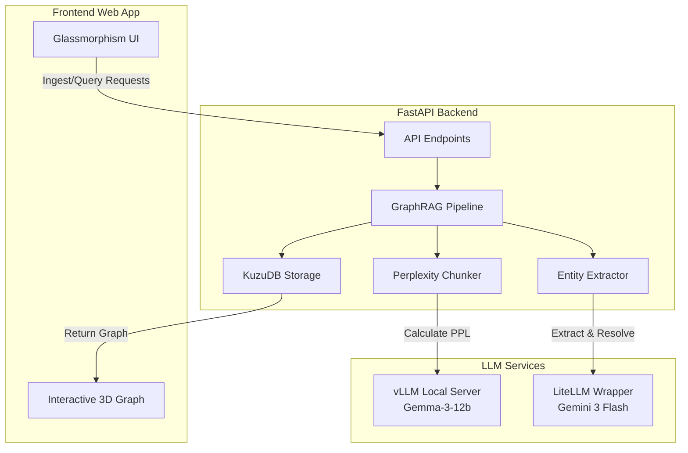

  <h1>GraphRAG</h1>
  
<em>An Advanced Graph Retrieval-Augmented Generation System</em>

  <!-- Badges -->
  

    
    
    
    
    
    
  

  <!--
  

    
  

  -->

---

## 📖 Overview

GraphRAG is a modern, full-stack application that leverages the power of Knowledge Graphs and Large Language Models (LLMs) to ingest raw text, extract structured entities and relationships, and allow users to query their data both semantically and visually. 

### ✨ Key Features
*   **Perplexity-Based Chunking**: Instead of arbitrarily splitting text, it uses a local model (Gemma via vLLM) to calculate sentence perplexity, splitting text dynamically at semantic boundaries (topic shifts).
*   **Smart Entity Resolution**: Uses a combination of deterministic string similarity (`difflib`) and LLM-powered merging to prevent duplicate entities and consolidate descriptions.
*   **Hybrid LLM Architecture**: Uses local vLLM for heavy, repetitive tasks (chunking perplexity) and Gemini (via LiteLLM) for complex reasoning (extraction and resolution).
*   **Embedded Graph Database**: Utilizes KuzuDB for ultra-fast, local graph storage and Cypher querying.
*   **Premium UI**: A sleek, responsive frontend featuring a Nord-inspired color palette, glassmorphism components, and interactive 3D graph visualization.

---

## 🏗️ Architecture

The system is designed as a monolithic API serving a static frontend, communicating with specialized LLM services.

---

## 📋 TODO:

- [X] ~~Implement user authentication & session management properly.~~ (half decent)
- [ ] Add support for document/multimodal uploads.
- [ ] Fine-tune perplexity spike threshold for different types of texts.
- [ ] Add graph layout saving(freeze nodes in specific positions) and other QOL features. (import functionality from portfolio website?)
- [ ] Checkout FalkorDB and perhaps migrate.
- [ ] Improve entity resolution (long term).
---

## 📜 License Information

Licensed under the **MIT License**.
