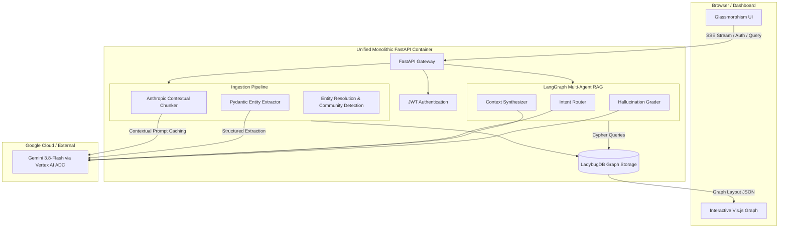

<div align="center">
  <h1>GraphRAG</h1>
  <p><em>Advanced Multi-Agent Graph Retrieval-Augmented Generation with Anthropic Contextual Chunking & LadybugDB</em></p>

  <!-- Badges -->
  <p>
    
    
    
    
    
    
    
  </p>
</div>

---

## 📖 Overview

**GraphRAG** is a modern, production-grade knowledge graph and retrieval-augmented generation (RAG) platform. It transforms unstructured documents into rich, queryable knowledge graphs, detects community clusters, and uses an adaptive multi-agent supervisor to perform hybrid graph-text reasoning with self-correction.

Built as a lightweight monolithic service on standard CPU infrastructure ($0 dedicated GPU cost, scales to zero on Google Cloud Run).

---

### ✨ Key Features

*   **Anthropic Contextual Retrieval**: Instead of arbitrary token windows, documents are partitioned into semantic chunks enriched with document-level situational context using prompt cache control (`cache_control: {"type": "ephemeral"}`).
*   **LadybugDB Embedded Graph Database**: High-performance in-process graph engine with full Cypher query support, ACID transactions, and zero external database management overhead.
*   **LangGraph Adaptive Multi-Agent Hybrid RAG**:
    *   **Router Agent**: Analyzes question complexity to route between structural graph traversal, vector/text retrieval, or hybrid fusion.
    *   **Graph Engine**: Executes Cypher traversal over 1-hop and 2-hop entity neighborhoods and community clusters.
    *   **Synthesizer Agent**: Formulates evidence-grounded answers citing specific graph entities and relations.
    *   **Self-Correction Grader**: Validates hallucination bounds and reroutes queries if context is insufficient.
*   **Gemini 3.8-Flash via Google Cloud ADC**: Enterprise authentication via Google Application Default Credentials (ADC) or API keys through LiteLLM.
*   **Resilient Fallback Extractor**: Graceful heuristic entity and relationship extraction fallback ensuring graph visualization remains interactive under all network conditions.
*   **Interactive Vis.js Graph Dashboard**: Glassmorphic UI featuring live real-time SSE ingestion progress, community color partitioning, and interactive node inspection.

---

## 🏗️ Architecture


```mermaid
graph TD
    subgraph Client [Browser / Dashboard]
        UI[Glassmorphism UI]
        Vis[Interactive Vis.js Graph]
    end

    subgraph Container [Unified Monolithic FastAPI Container]
        API[FastAPI Gateway]
        Auth[JWT Authentication]
        
        subgraph Pipeline [Ingestion Pipeline]
            Chunker[Anthropic Contextual Chunker]
            Extractor[Pydantic Entity Extractor]
            Resolver[Entity Resolution & Community Detection]
        end
        
        subgraph LangGraph_Engine [LangGraph Multi-Agent RAG]
            Router[Intent Router]
            Synthesizer[Context Synthesizer]
            Grader[Hallucination Grader]
        end
        
        DB[(LadybugDB Graph Storage)]
    end

    subgraph Cloud [Google Cloud / External]
        Gemini[Gemini 3.8-Flash via Vertex AI ADC]
    end

    UI -->|SSE Stream / Auth / Query| API
    API --> Auth
    API --> Pipeline
    API --> LangGraph_Engine
    
    Chunker -->|Contextual Prompt Caching| Gemini
    Extractor -->|Structured Extraction| Gemini
    Pipeline --> DB
    
    LangGraph_Engine -->|Cypher Queries| DB
    Router --> Gemini
    Synthesizer --> Gemini
    Grader --> Gemini
    
    DB -->|Graph Layout JSON| Vis
```

---

## 🚀 Quickstart

### Prerequisites
* [Docker](https://docs.docker.com/engine/install/) & [Docker Compose v2](https://docs.docker.com/compose/)
* Google Cloud ADC or a [Google AI Studio Gemini API Key](https://aistudio.google.com/app/apikey)

### Running Locally

1. **Clone the repository**:
   ```bash
   git clone https://github.com/k0y0min/graphrag.git
   cd graphrag
   ```

2. **Configure environment**:
   ```bash
   cp backend/.env.example backend/.env
   # Optionally set your GEMINI_API_KEY in backend/.env if not using GCP ADC:
   # GEMINI_API_KEY=AIzaSy...
   ```

3. **Start the monolithic service**:
   ```bash
   docker compose up -d --build
   ```

4. **Access the dashboard**:
   * Open your browser at **`http://localhost:8080/`**
   * Register a user account and begin ingesting text!

---

## 🧪 Running Tests

The test suite validates authentication, LadybugDB Cypher queries, Anthropic Contextual Chunking, community detection, and LangGraph multi-agent execution:

```bash
# Run unit tests
pytest tests/test_graphrag.py

# Run full system integration verification
python tests/verify_full_system.py
```

---

## 📜 License

Licensed under the **MIT License**.
